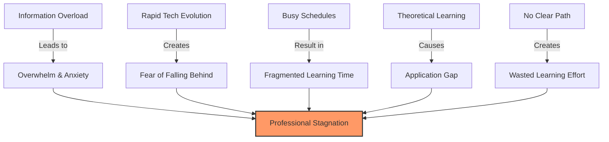
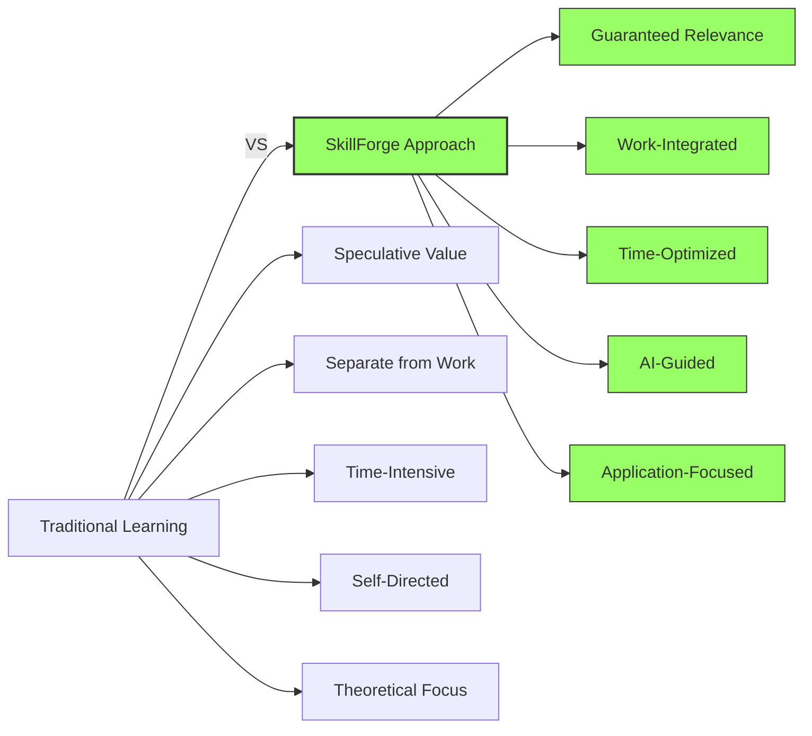
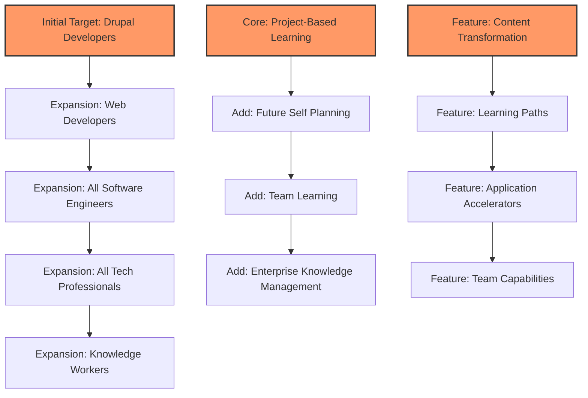
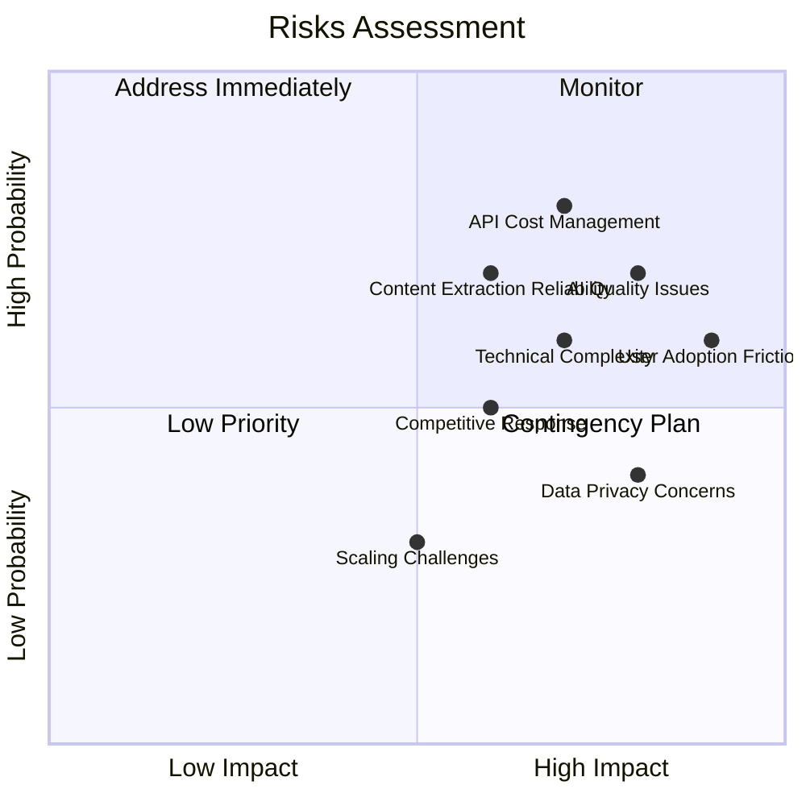
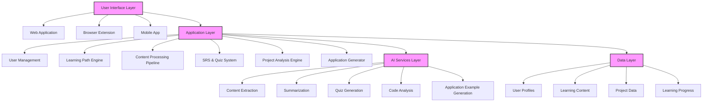
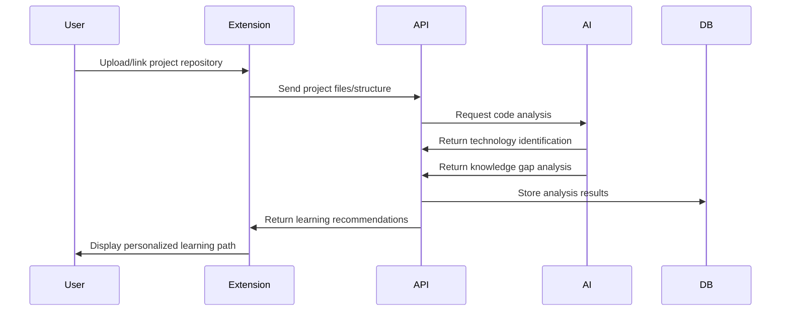
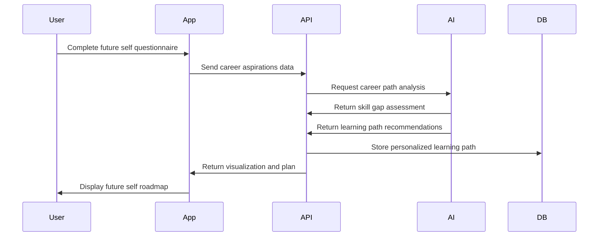
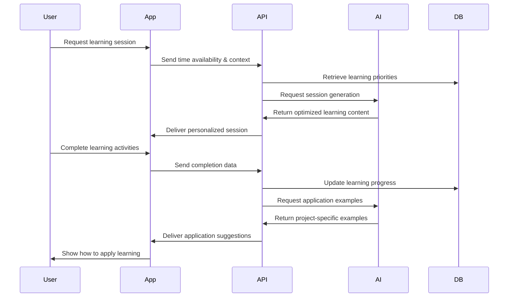
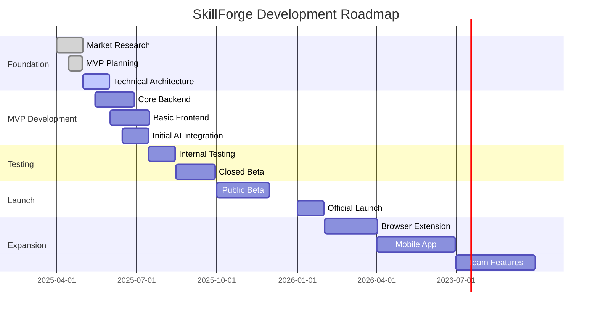
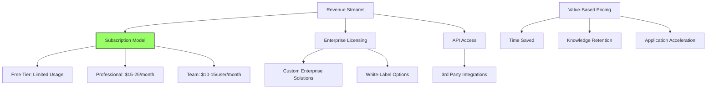

# SkillForge: Practical Learning for Busy Professionals

## Executive Summary

SkillForge is a learning platform designed specifically for busy professionals who need to continuously develop their skills but struggle with traditional learning approaches. The platform connects learning directly to work by either analyzing current projects to suggest relevant skills or working backward from a future career vision. SkillForge transforms passive content consumption into active, applicable learning with immediate professional impact.

## 1. The Problem Landscape

### Common Scenarios

1. **The Overwhelmed Developer**
   - Sarah, a Drupal developer, feels bombarded by new technologies (Headless CMS, JAMstack, AI integration)
   - She bookmarks dozens of articles and tutorials but rarely finds time to read them
   - When she does learn something new, she struggles to apply it to her current projects
   - She feels constantly behind despite spending hours trying to keep up

2. **The Directionless Learner**
   - Michael regularly starts online courses but rarely finishes them
   - He's unsure which technologies will actually advance his career
   - His learning feels random and disconnected from his daily work
   - Despite consuming content, he can't measure any tangible skill improvement

3. **The Time-Starved Professional**
   - Priya can only find 15-30 minute blocks for learning between client projects
   - Traditional courses and tutorials don't fit her fragmented schedule
   - She forgets earlier lessons before she can complete a learning sequence
   - Her professional development stalls despite genuine effort and interest

4. **The Theory-Practice Gap Victim**
   - Alex completes tutorials but struggles to implement the concepts in real projects
   - He understands concepts in isolation but can't connect them to his existing codebase
   - His theoretical knowledge doesn't translate to practical capability
   - His learning rarely results in improved work output

## 2. Value Proposition: Why SkillForge Stands Out

### Core Value Propositions with Scenarios

#### 1. Learning With Guaranteed Relevance

**Value**: Every minute spent learning has clear purpose and application.

**Scenario**: James, a Drupal developer, uploads his current project to SkillForge. The system analyzes his codebase and identifies that he's attempting to integrate a payment gateway without proper security measures. SkillForge immediately creates a personalized learning module on secure payment processing in Drupal with code examples that directly apply to his project. James learns exactly what he needs when he needs it, saving hours of research and potential security issues.

#### 2. The End of Information Anxiety

**Value**: Data-driven clarity on what matters for your specific career path.

**Scenario**: Lisa feels overwhelmed by the pressure to learn React, Vue, Angular, Svelte, and other frontend frameworks. She inputs her career goals into SkillForge, which analyzes market trends, her current skills, and future aspirations. The system recommends focusing on React and GraphQL based on her specific situation, with clear explanations of why these technologies matter most for her path. Lisa now confidently invests her limited learning time in the highest-impact areas.

#### 3. Frictionless Knowledge-to-Application Pipeline

**Value**: Direct translation of learning into working code and capabilities.

**Scenario**: After completing a 15-minute module on Drupal's Entity API, SkillForge generates custom code snippets that Miguel can directly implement in his current project. The system identifies three specific places in his codebase where the new pattern would improve performance. Miguel immediately applies his learning, seeing a tangible performance improvement the same day he learned the concept.

#### 4. Time-Adaptive Learning

**Value**: Progress that accumulates meaningfully even with sporadic usage.

**Scenario**: Aisha has an unpredictable schedule with client emergencies often disrupting planned learning time. SkillForge adapts to her reality, providing 5-minute microlearning sessions when she's busy and automatically expanding to deeper 30-minute sessions when her calendar shows availability. The system maintains continuity between sessions, so her progress builds coherently despite the irregular schedule.

#### 5. Compound Knowledge Interest

**Value**: Building a permanent foundation where each new skill becomes easier to acquire.

**Scenario**: Over three months of using SkillForge, Carlos notices that new JavaScript concepts are becoming easier to grasp. The system has been strategically reinforcing his foundational knowledge while introducing new concepts, creating connections between ideas. SkillForge shows him a visualization of his knowledge network, demonstrating how his learning efficiency has increased 40% since he started.

## 3. Business Scope

### Initial Focus

- **Target Users**: Drupal developers (leveraging your expertise)
- **Core Problem**: Keeping up with rapidly evolving web technologies
- **Geographic Market**: Global, English-speaking initially
- **Key Differentiator**: Direct connection to current projects and codebase

### Expansion Strategy

1. **Horizontal Expansion**: Broaden to all web developers, then all software engineers
2. **Vertical Expansion**: Deepen features for the initial Drupal developer audience
3. **Team Capabilities**: Evolve from individual to team learning management
4. **Enterprise Solutions**: Develop organization-wide knowledge management features

## 4. Challenges and Risks

### Key Challenges

1. **AI Quality and Consistency**
   - Risk: Inconsistent quality of AI-generated summaries, quizzes, and application examples
   - Mitigation: Implement quality scoring system, human review for critical content, continuous model fine-tuning

2. **API Cost Management**
   - Risk: OpenAI/Anthropic API costs could significantly impact margins
   - Mitigation: Implement caching strategies, optimize prompt engineering, explore model distillation for common tasks

3. **User Adoption Friction**
   - Risk: Users resist adding another tool to their workflow
   - Mitigation: Focus on seamless integration with existing workflows, demonstrate immediate value, minimize required user input

4. **Competitive Response**
   - Risk: Existing learning platforms add similar features
   - Mitigation: Move quickly to establish market position, focus on depth of integration with development workflows

5. **Technical Complexity**
   - Risk: Coordinating multiple AI processes reliably at scale
   - Mitigation: Modular architecture, comprehensive testing, gradual feature rollout

## 5. Solution Architecture

### Technical Stack

- **Frontend**: React SPA for web application, browser extension using Manifest V3
- **Backend**: Drupal 10 providing API services, content management, and user management
- **AI Processing**: Custom modules for OpenAI/Anthropic API integration
- **Database**: PostgreSQL for structured data, potentially Elasticsearch for advanced search
- **Infrastructure**: Cloud hosting (AWS/GCP/Azure) with containerization for scalability

### Core Workflows

#### Project Analysis Workflow

#### Future Self Planning Workflow

#### Learning Session Workflow

## 6. Plan of Action

### Phase 1: MVP (3 months)

1. **Core Platform Development**
   - User account system
   - Basic content processing pipeline
   - Simple project analysis functionality
   - Foundational learning path generation
   - Minimal viable UI

2. **Initial AI Integration**
   - Content summarization
   - Basic quiz generation
   - Simple code analysis

3. **Testing & Validation**
   - Internal testing with your own projects
   - Limited beta with 10-20 Drupal developers
   - Feedback collection and iteration

### Phase 2: Market Entry (3 months)

1. **Feature Enhancement**
   - Improved AI processing quality
   - Enhanced project analysis
   - Future self planning functionality
   - Application example generation

2. **Platform Expansion**
   - Browser extension development
   - Content library expansion
   - Search and discovery improvements

3. **Go-to-Market**
   - Public beta launch
   - Content marketing campaign
   - Drupal community engagement

### Phase 3: Growth (6 months)

1. **Advanced Features**
   - Spaced repetition system
   - Team collaboration features
   - Advanced analytics and insights
   - Mobile application

2. **Market Expansion**
   - Targeting broader web development community
   - Partnership development
   - Integration with popular development tools

3. **Optimization**
   - Performance improvements
   - Cost optimization
   - Scalability enhancements

## 7. Monetization Strategy

### Subscription Tiers

1. **Free Tier**
   - Limited content processing (5 items/month)
   - Basic summaries and quizzes
   - Project analysis with limited depth
   - No future self planning
   - Purpose: User acquisition and demonstration of value

2. **Professional Tier ($15-25/month)**
   - Unlimited content processing (fair use policy)
   - Advanced AI processing with higher-quality outputs
   - Full project analysis capabilities
   - Future self planning and tracking
   - Application example generation
   - Purpose: Individual professional revenue

3. **Team Tier ($10-15/user/month, minimum 5 users)**
   - All Professional features
   - Shared content library
   - Team learning paths
   - Knowledge gap analysis across team
   - Learning progress tracking for managers
   - Purpose: Expand to organizational use

### Enterprise Solutions

- Custom pricing based on organization size and needs
- Integration with internal systems and codebases
- Custom AI model training for company-specific knowledge
- Advanced analytics and reporting
- Dedicated support and customization

### Revenue Projections

- **Year 1**: Focus on product-market fit, target 1,000 paying users
- **Year 2**: Expansion phase, target 10,000 paying users
- **Year 3**: Team/Enterprise focus, target 25,000 individual users plus 50 enterprise clients

## 8. Next Steps

1. **Validate Core Assumptions**
   - Conduct user interviews with 15-20 Drupal developers
   - Test AI processing quality with sample content
   - Validate willingness to pay through pre-sales conversations

2. **Technical Prototype**
   - Develop proof-of-concept for project analysis
   - Test AI integration for content processing
   - Evaluate API costs and optimization strategies

3. **Business Planning**
   - Finalize initial investment requirements
   - Develop detailed marketing strategy
   - Create partnership outreach plan

4. **Team Building**
   - Identify key roles needed for MVP development
   - Consider technical co-founder if needed
   - Establish advisory relationships with industry experts

---

As your business partner, I believe SkillForge addresses a critical need in the professional development space with a unique, AI-powered approach that respects the time constraints and practical needs of busy professionals. The initial focus on Drupal developers leverages your expertise while providing a clear path to broader market expansion.

The key to success will be delivering on the core promise: learning that directly and immediately enhances work capabilities. By maintaining this focus on practical application and measurable impact, SkillForge can differentiate itself in an increasingly crowded learning platform market.

Let's move forward with the validation phase to confirm our assumptions before significant development investment.
